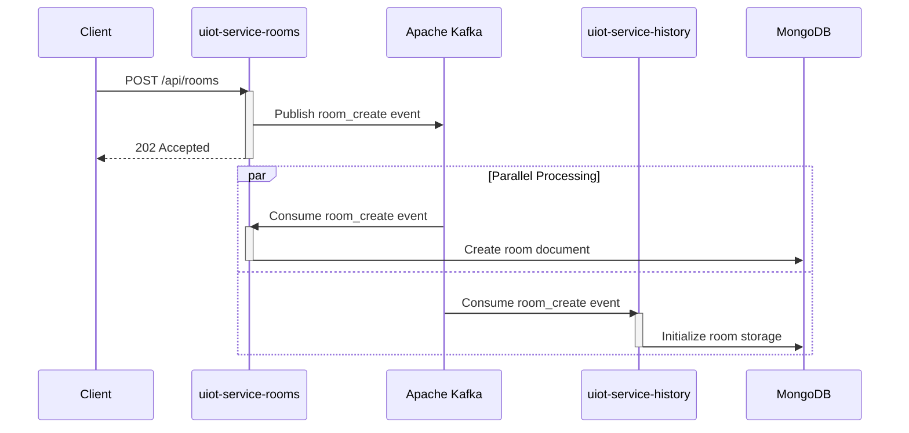
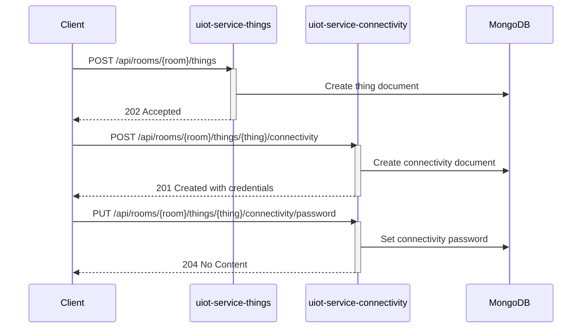
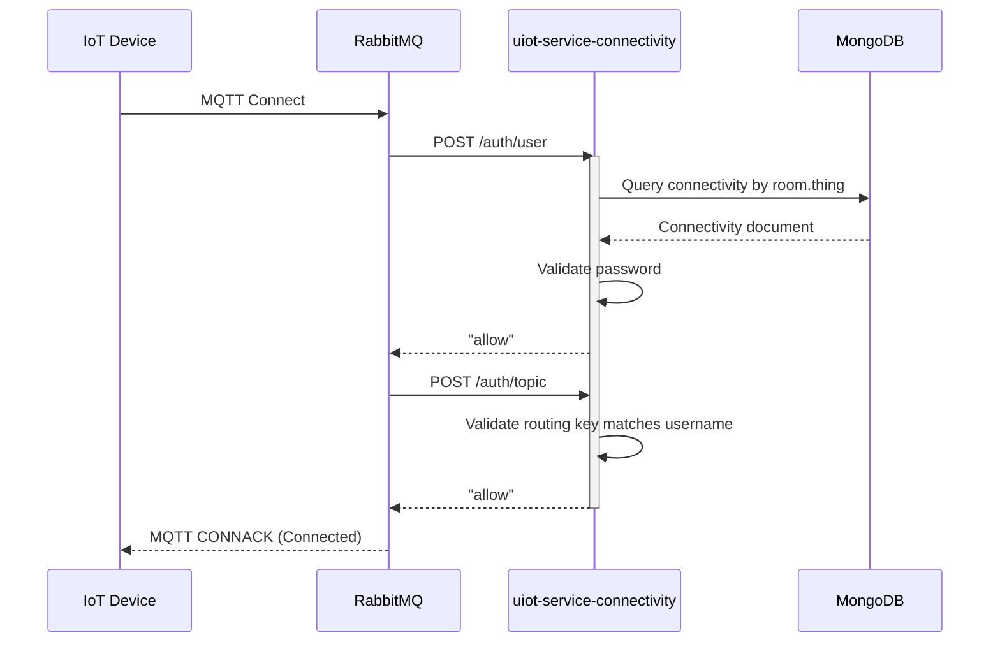
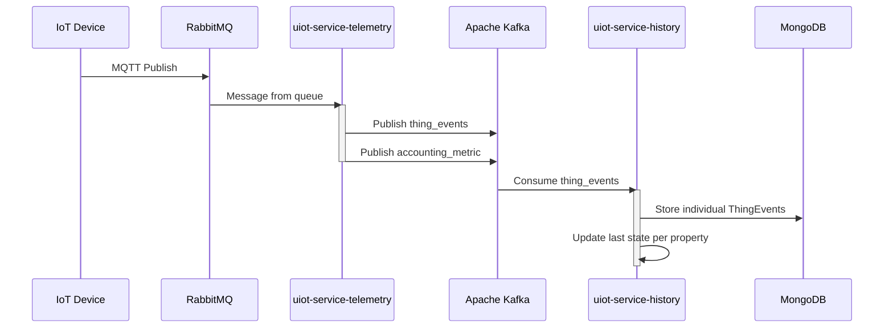
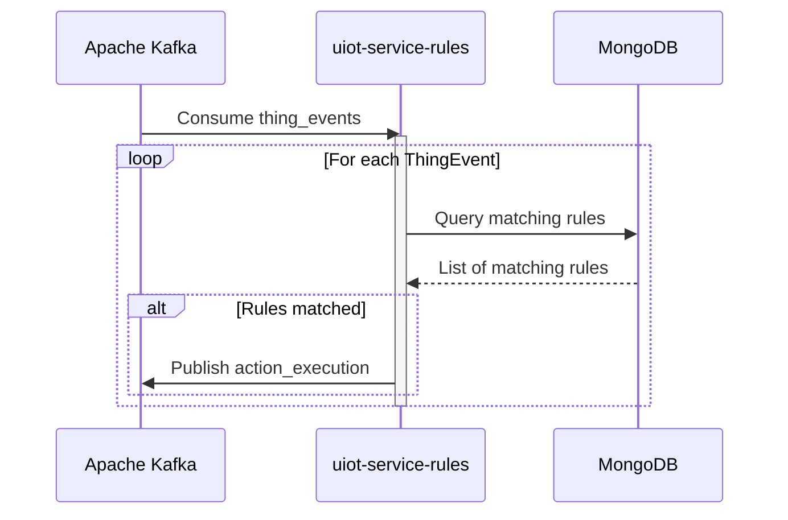
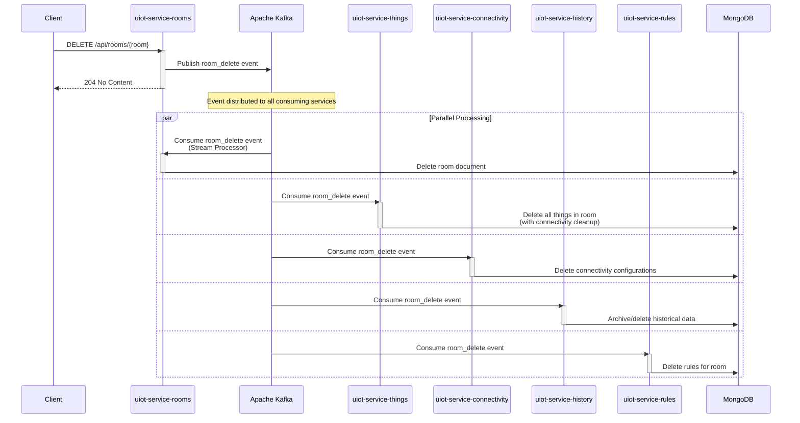

# uIoT

> **Pronounced: _"micro IoT"_.**

A prototype of an IoT telemetry system, demonstrating microservices communication over Apache Kafka and REST APIs.
Implemented as a part of the master's thesis _Analysis of selected communication techniques in systems based on
microservices architecture_ at [Cracow University of Technology](https://pk.edu.pl) by Damian Malczewski in 2021.

Since then, it has been used to test new features in Spring Boot and to explore concepts related to system architecture
and microservices.

## Table of Contents

- [Prerequisites](#prerequisites)
- [System Overview](#system-overview)
- [Microservices](#microservices)
- [Notable Use Cases](#notable-use-cases)
    - [Room Creation Flow](#room-creation-flow)
    - [IoT Device Registration and Authentication](#iot-device-registration-and-authentication)
    - [Telemetry Data Processing](#telemetry-data-processing)
    - [Rule Engine and Automation](#rule-engine-and-automation)
    - [Room Deletion with Cascade Cleanup](#room-deletion-with-cascade-cleanup)
- [Tools](#tools)
- [Running in Docker environment](#running-in-docker-environment)
    - [Building Docker images](#building-docker-images)
    - [`uiot-docker-localhost`](#uiot-docker-localhost)
    - [`uiot-docker-compose`](#uiot-docker-compose)

## Prerequisites

1. **Java 25**. Required for building and running Spring Boot services.
2. **Gradle**. Build tool, included as wrapper in the project.
3. **Docker and Docker Compose**. Container runtime, required for running services in a containerized environment.
4. [**Kaf CLI Tool**](#kaf-cli-tool). Useful for managing, listening to and debugging Kafka topics.
5. [**Mosquitto MQTT Clients**](#mosquitto-mqtt-clients). Useful for testing MQTT communication.
6. **MongoDB Compass**. GUI client for MongoDB, optional but recommended for inspecting data.

## System Overview

The uIoT system is built using a microservices architecture with event-driven communication through Apache Kafka. The
system provides:

- **IoT Device Management**: Registration, authentication, and lifecycle management.
- **Real-time Telemetry Processing**: MQTT to Kafka bridge with stream processing.
- **Rule Engine**: Automated actions based on telemetry data conditions.
- **Historical Data Storage**: Time-series data with query capabilities.
- **Resource Management**: Hierarchical organization with rooms containing devices.

## Microservices

The system consists of 7 microservices, each with specific responsibilities. Each service has its own `README.md` with
detailed documentation.

| Service                                                                            | Port   | Description                                             |
|------------------------------------------------------------------------------------|--------|---------------------------------------------------------|
| [**uiot-service-accounting**](uiot-services/uiot-service-accounting/README.md)     | `8331` | Resource usage accounting and billing analytics.        |
| [**uiot-service-connectivity**](uiot-services/uiot-service-connectivity/README.md) | `8332` | Device authentication and RabbitMQ MQTT integration.    |
| [**uiot-service-history**](uiot-services/uiot-service-history/README.md)           | `8333` | Historical telemetry storage and last-state management. |
| [**uiot-service-rooms**](uiot-services/uiot-service-rooms/README.md)               | `8334` | Room management and top-level hierarchy container.      |
| [**uiot-service-rules**](uiot-services/uiot-service-rules/README.md)               | `8335` | Rule engine for automated actions on telemetry events.  |
| [**uiot-service-telemetry**](uiot-services/uiot-service-telemetry/README.md)       | `8336` | MQTT to Kafka bridge for telemetry data ingestion.      |
| [**uiot-service-things**](uiot-services/uiot-service-things/README.md)             | `8337` | IoT device (Thing) lifecycle management within rooms.   |

> **Note:** In Docker environment, all HTTP APIs are served on port `8080` for unification purposes.

### Supporting Libraries

| Library                                                                     | Description                                       |
|-----------------------------------------------------------------------------|---------------------------------------------------|
| [**uiot-library-models**](uiot-libraries/uiot-library-models/README.md)     | Shared DTOs for Kafka and RabbitMQ communication. |
| [**uiot-library-problems**](uiot-libraries/uiot-library-problems/README.md) | RFC 7807 problem handling utilities.              |

## Notable Use Cases

### Room Creation Flow

Demonstrates the event-first approach used throughout the system:



### IoT Device Registration and Authentication

#### Device Registration

IoT device registration and connectivity setup:



#### MQTT Authentication Flow

Device authentication and authorization for MQTT communication:



### Telemetry Data Processing

End-to-end telemetry flow from MQTT to Kafka with message transformation:



### Rule Engine and Automation

Real-time telemetry processing with automated rule matching and action triggering:



### Room Deletion with Cascade Cleanup

Shows distributed cleanup coordination across all microservices:



## Tools

### Kaf CLI Tool

For managing Kafka topics, you can use the [`kaf`](https://github.com/birdayz/kaf) CLI tool. Follow its installation
manual on linked GitHub repository page.

After installation, you can add a cluster configuration for local Kafka instance.

```bash
kaf config add-cluster uiot_local -b localhost:9092
```

Kaf stores its configuration in `~/.kaf/config` file. To verify if the configuration is correct, browse that file.

If you have multiple clusters configured, you can select the one you want to use with the following command.

```bash
kaf config select-cluster
```

### Mosquitto MQTT Clients

Tool for testing MQTT communication. Note to install `mosquitto-clients` package, not `mosquitto` itself.

```bash
sudo apt install mosquitto mosquitto-clients
```

To publish a message to a topic, you can use the `mosquitto_pub` command. For example, for `room_uid=main` and
`thing_uid=sensor01` that has enabled connectivity with password `"string"`, you can publish a telemetry message like
this:

```bash
mosquitto_pub \
    -t "telemetry/main/sensor01" \
    -m '[{"n":"urn:dev:uiot:main:sensor01:value","v":12}]' \
    -u 'main.sensor01' \
    -P 'string' \
    -q 1 \
    -h localhost -p 1883
```

## Running in Docker environment

There are two main Docker Compose stacks:

1. **uiot-docker-localhost**: Contains common dependencies like MongoDB, Kafka, and RabbitMQ for local development. This
   stack automatically creates MongoDB schemas and Kafka topics on startup.
2. **uiot-docker-compose**: Contains a demo of full-stack application services, with dependencies, Swagger UI. Not a
   production ready setup, but enough to launch the entire system with a single command and explore its capabilities.

Note that both stacks rely on `depends_on` and healthcheck, so make sure to use most recent Docker Compose version, as
older ones didn't support it fully.

### Building Docker images

To build Docker images for all services use `docker.sh` script. It runs `./gradlew clean build` and then builds
Docker images for all services with the same version tag.

```bash
UIOT_VERSION=latest ./docker.sh
```

It's not necessary, as Docker images are published to Docker Hub with tags matching GitHub releases, but to run the
system with latest changes, you need to build images locally.

### `uiot-docker-localhost`

Run services with following command.

```bash
cd uiot-docker/uiot-docker-localhost/
docker-compose up -d
```

Then, after a while, your services will be ready for local development. Kafka topic are automatically created.

### `uiot-docker-compose`

```bash
cd uiot-docker/uiot-docker-compose/
docker-compose up -d
```

Then, after a while, your system demo will be ready for usage and exploration.

Navigate to http://localhost:8330/ to access the Swagger UI documentation of all services. Note that services take
some time to start, so you may need to wait a moment before the documentation is available. You can switch between
service APIs using the dropdown in the top-right corner of the Swagger UI (dropdown named `Select a definition`).
